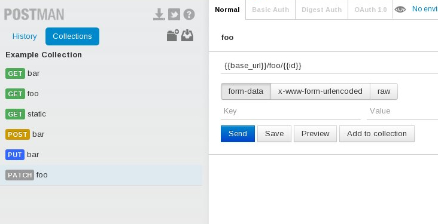

=============
flask2postman
=============

A tool that creates a Postman configuration from a Flask application.

Install
=======

.. code-block:: sh

    $ pip install flask2postman

Example
=======

See :code:`example.py` for the example application.

.. code-block:: sh

    $ flask2postman example.app --name "Example Collection" > example.json

It will write the generated JSON configuration into a :code:`example.json` file,
then you just have to import than file into Postman ("Import Collection" button,
left panel, top right), and profit:

Usage
=====

.. code-block:: sh

    usage: flask2postman [-h] [-n NAME] [-b BASE_URL] [-a] flask_instance

    positional arguments:
      flask_instance

    optional arguments:
      -h, --help            show this help message and exit
      -n NAME, --name NAME  Postman collection name (default: current directory
                            name)
      -b BASE_URL, --base_url BASE_URL
                            the base of every URL (default: {{base_url}})
      -a, --all             also generate OPTIONS/HEAD methods

License
=======

MIT
